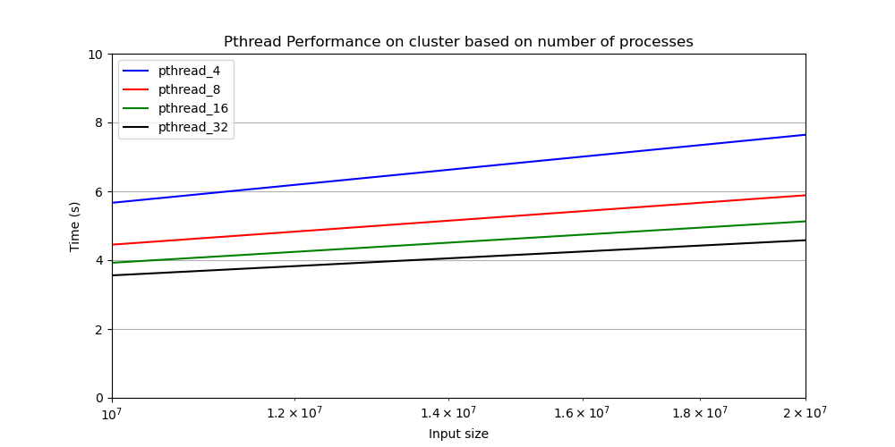

# RSA_Algorithm

## Echipa

- Farhad Ali Irinel Gul, 344C1
- Eduard Petcu, 344C1

## Structura proiectului
```
├── check.py (checkerul folosit pentru rularea implementarilor)
├── create_graphics.py (script folosit pentru generarea graficlor)
├── graphics (graficele cu _zoomed au fost create pentru a evidentia diferenta 
│   │          intre rulari cu timp de executie apropiati)
│   ├── cluster (graficele generate pe cluster)
│   │   ├── mpi_all.png
│   │   ├── mpi_openmp_all.png
│   │   ├── mpi_openmp_zoomed.png
│   │   ├── mpi_zoomed.png
│   │   ├── pthread_all.png
│   │   ├── pthread_zoomed.png
│   │   ├── the_best_all.png
│   │   └── the_best_zoomed.png
│   └── local (grafice generate local)
│       ├── 2023-12-16_19-13-43_all.png
│       ├── 2023-12-16_19-13-43_zoomed.png
│       ├── 2023-12-16_19-17-35_all.png
│       ├── 2023-12-16_19-17-35_zoomed.png
│       ├── 2023-12-16_19-22-00_all.png
│       ├── 2023-12-16_19-22-00_zoomed.png
│       ├── 2023-12-16_19-28-05_all.png
│       └── 2023-12-16_19-28-05_zoomed.png
├── Makefile
├── README.md
├── rsa_cuda_opt.cu
├── rsa.hpp
├── rsa_mpi.cpp
├── rsa_mpi_openmp.cpp
├── rsa_openmp.cpp
├── rsa_pthread.cpp
├── rsa_serial.cpp
├── rsa_serial_opt.cpp
├── stats (Timpul de executie obtinut pe fiecare implementare pe toate testele)
│   ├── 2023-12-16_19-13-43.pkl
│   ├── 2023-12-16_19-17-35.pkl
│   ├── 2023-12-16_19-22-00.pkl
│   └── 2023-12-16_19-28-05.pkl
├── tests
│   ├── input (fisierele pe care sunt testate implementarile)
│   │   ├── test00.txt
│   │   ├── test01.txt
│   │   ├── test02.txt
│   │   ├── test03.txt
│   │   ├── test04.txt
│   │   ├── test05.txt
│   │   ├── test06.txt
│   │   ├── test07.txt
│   │   ├── test08.txt
│   │   ├── test09.txt
│   │   └── test_huge.txt
│   └── output (fisierele cu mesajul din fisierele de input sub forma criptata si decriptata)
└── Weekly.md
```

## Descriere proiect

Encriptarea si decriptarea RSA a unui mesaj are la baza un algoritm ce se 
foloseste de o cheie publica si una privata, generate in urma unui proces
dificil din punct de vedere computational. 
Pasii urmati au fost urmatorii:
- am ales doua numere prime mari, p si q.
- am calculat produsul n = p * q
- am calculat totientul lui n (indicatorul lui Euler): phi(n) = (p - 1) * (q - 1)
- am ales un numar e astfel incat e sa fie coprim cu phi(n) si
1 < e < phi(n)


## Ce am paralelizat?

In cadrul algoritmului RSA, am incercat sa paralelizam mai multe portiuni. 
Am analizat ce anume am obtinut si am decis ce anume sa ramana paralelizat.
Pentru a intelege solutia finala, e nevoie sa descriem putin pasii implementarii:

1. Generarea vectorului de numere prime

2. Calcularea cheilor publice si private

3. Criptarea textului pe baza cheii publice

4. Decriptarea textului pe baza cheii private

Nivelul de paralelism cel mai evident care s-a dovedit a fi suficient de bun este 
cel al paralelizarii textului la nivel de criptare si decriptare. Adica in loc sa 
criptam si sa decriptam tot textul pe un singur thread / proces, am ales sa impartim 
textul pe mai multe, in functie de implementare.

Deci cel mai important nivel de paralelizare este cel al textului.

Am paralelizat si generarea de numere prime incercand ciurul lui Atkin care putea 
fi paralelizat, dar s-a dovedit a fi mai ineficient (masurat cu 
time si perf din check.py) decat generarea seriala din cauza overhead-ului adus de 
crearea de thread-uri sau procese pentru un task destul de simplu, paralelizarea avand 
sens doar la generarea de numere extrem de foarte mari (primele 10 000 000 numere prime).

Alt nivel de paralelism pe care l-am implementat in OpenMP a fost cel al citirii textului 
de criptat simultan cu generarea de chei doar ca citirea se face foarte rapid chiar si la 
testele mari, deci am decis sa pastram acest lucru doar pe varianta de OpenMP.

Pentru a nu exagera, am decis sa nu ne gandim doar in directia paralelizarii fara sa optimizam 
putin varianta seriala. Astfel, am lasat rsa_serial.cpp cu o implementare a criptarii si decriptarii 
mai lente. Pentru solutiile finale, am folosit optimizarea descrisa mai jos (algoritmul de exponentiere 
modulara) care a venit cu rezultate mult mai bune decat anticipasem.

O mica evidentiere a optimizarii pentru primele 5 teste:

| Input Size | Time Execution(s) - Serial   | Time Execution(s) - Serial Optimizat  |
| :--------: | :--------------------------: | :-----------------------------------: |
| 23         | 13.29                        | 1.32                                  |
| 34         | 19.45                        | 1.32                                  |
| 56         | 31.92                        | 1.32                                  |
| 59         | 33.58                        | 1.32                                  |
| 70         | 39.67                        | 1.33                                  |
| 130        | 73.60                        | 1.32                                  |

Am oprit compararea dupa 5 teste intrucat varianta seriala simpla tindea sa obtina timp extrem de mari.
Pe varianta seriala optimizata se obtin valori la fel de bune ca pe implementarile paralelizate 
pe testele mai mici (deoarece nu este necesara generarea de thread-uri / procese) pentru cazuri simple. 
Solutiile paralelizate se scaleaza pe testele mari destul de mult.

Un tabel cu toti timpii obtinuti pe varianta seriala optimizata pentru a fi comparati ulterior cu 
solutiile paralele si timpii obtinuti pe implementarea OpenMP pentru o comparatie directa:

| Input Size | Time Execution(s) - Serial Optimizat | Time Execution(s) - OpenMP |
| :--------: | :----------------------------------: | :------------------------: |
| 23         | 1.32                                 | 1.21                       |
| 34         | 1.32                                 | 1.20                       |
| 56         | 1.32                                 | 1.20                       |
| 59         | 1.32                                 | 1.20                       |
| 70         | 1.33                                 | 1.20                       |
| 130        | 1.32                                 | 1.20                       |
| 80000      | 1.44                                 | 1.21                       |
| 160000     | 1.71                                 | 1.22                       |
| 320000     | 3.72                                 | 1.24                       |
| 640000     | 12.14                                | 1.27                       |
| 1280000    | 43.92                                | 1.35                       |
| 2560000    | 170.11                               | 1.47                       |
| 40000000   | PREA MULT                            | 5.39                       |


## Rularea algoritmilor si a checkerului
Algoritmii au fost rulati local si pe cluster folosind fisierul `check.py` 
astfel: `python3 check.py test run_<implementare>` pentru a vedea timpul 
scos de o anumita implementare pe teste de diferite marimi. Pentru a obtine
graficele am folosit comanda: `python3 check.py stats`.

Exemplu rulari:

```
python3 check.py test run_serial_opt

python3 check.py perf run_serial_opt 0

python3 check.py perf run_serial_opt 18

```

Toate comenzile disponibile:

```
python3 check.py test run_<implementare> -> analizeaza timpul pe 
implementarea data

python3 check.py stats -> genereaza statistici in pkl pentru toate 
implementarile in care se retin timpul de executie

python3 check.py perf run_<implementare> <numer_test> -> ruleaza perf 
pe executabilul oferit si salveaza in ./perf/ rezultatele obtinute

```

## Rularea locala si pe cluster

Pentru obtinerea timpilor de executie, am rulat local 
dar si pe cluster (cu ajutorul documentatiei [1]), haswell cu 32 de procesoare
pentru MPI, tot acolo variantele de pthread, openmp si 
seriala. Pentru CUDA, am folosit xl, pe care am obtinut 
timpi relativi apropiati de cei de pe local, avand 
pe laptop un RTX 3050.

## Profiling

Profiling-ul a fost realizat pentru a determina functiile in care programul
petrece cel mai mult timp si de a le optimiza pe acestea. 
Am rulat perf [2] pentru a determina ce functii necesita optimizari. 

Perf pe versiunea seriala neoptimizata:


Programul este CPU Bounded din cauza numarului mare de operatii la nivel
de decriptare adica undeva la private_key iteratii per fiecare caracter, 
iar aceasta valoare este destul de mare in generare, se vede in poza 
de mai jos ca sta cel mai mult in decriptare pe un test banal (testul 0).


Perf pe versiunea seriala optimizata


Dupa ce am introdus optimizarea explicata 
(la capitolul Criptare si decriptare), 
se poate observa ca pe un test mai greut (testul 18) timpul a 
fost redus semnificativ (reiese din grafice) si timpul 
petrecut in decriptare a fost redus la minim.


Perf pe implementarea cu openmp


Perf pe implementarea cu pthread


Rezultatele celor 2 rulari in perf de mai sus sunt intuitive, 
decriptarea fiind paralelizata, tot ramane sectiunea cea mai 
puternic computationala din tot codul, doar ca, datorita paralelizarii, 
aceasta are timpul de executie mult mai redus.

## Generarea numerelor prime

Pentru generarea numerelor prime, am considerat ca metode optime de implementare
Ciurul lui Eratosthernes, Ciurul lui Atkin sau Ciurul lui Sundaram. Pentru situatia
noastra, luand in considerare ca marimea cheilor publice/private este de 
maximum 10<sup>9</sup>, numarul de numere prime necesar este intre 10000 si 50000.
Am analizat articolul [3] ce evidentiaza performantele celor 3 implementari si
am ales sa implementez atat Ciurul lui Eratosterne cat si Ciurul lui Atkin, 
urmand a le compara si a-l pastra pe cel ce obtinea timpii de executie cei
mai buni.  
Am optat in final pentru Ciurul lui Eratostherne.

## Criptare si decriptare
Operatia de criptare are la baza ecuatia C ≡ m<sup>e</sup> mod n unde C reprezinta
mesajul criptat, m reprezinta mesajul dinainte de criptare iar e este cheia 
publica. Aceasta se poate rezolva folosind algoritmi de exponentiere modulara.
Pentru inceput, am folosit un algoritm simplu de exponentiere modulara [4] ce 
avea complexitatea temporala liniara. 
Acest algoritm a fost inlocuit cu unul de exponentiere modulara in timp 
logaritmic [5] scazand drastic timpul de executie al implementarii seriale de 
la `O(e)` (unde e poate fi marimea cheii publice sau private) la `O(log(e))`.

Decriptarea se bazeaza pe ecuatia m ≡ C<sup>d</sup> mod n unde d este cheia 
privata si functioneaza pe baza aceluiasi algoritm ca si functia de criptare.

## Implementari RSA

### Pthreads + MPI + (OpenMP+MPI)

#### Rezultate masuratori

| Nr threaduri | Input Size | Time Execution(s) - Pthread | Time Execution (s) - MPI | Time Execution (s) - OpenMP+MPI |
| :----------: | :--------: | :-------------------------: | :----------------------: | :-----------------------------: |
| 4            | 23         | 1.25                        | 3.44                     | 2.98                            |
| 4            | 34         | 1.25                        | 3.03                     | 3.05                            |
| 4            | 56         | 1.25                        | 3.09                     | 3.05                            |
| 4            | 59         | 1.25                        | 3.01                     | 3.08                            |
| 4            | 70         | 1.25                        | 2.97                     | 3.02                            |
| 4            | 130        | 1.25                        | 3.01                     | 3.08                            |
| 4            | 80000      | 1.27                        | 3.00                     | 3.05                            |
| 4            | 160000     | 1.28                        | 3.20                     | 3.04                            |
| 4            | 320000     | 1.32                        | 3.15                     | 3.10                            |
| 4            | 640000     | 1.38                        | 3.14                     | 3.09                            |
| 4            | 1280000    | 1.51                        | 3.20                     | 3.15                            |
| 4            | 2560000    | 1.78                        | 3.41                     | 3.11                            |
| 4            | 40000000   | 9.62                        | 9.50                     | 4.37                            |
| 8            | 23         | 1.25                        | 3.49                     | 3.55                            |
| 8            | 34         | 1.25                        | 3.30                     | 3.36                            |
| 8            | 56         | 1.25                        | 3.41                     | 3.42                            |
| 8            | 59         | 1.25                        | 3.51                     | 3.53                            |
| 8            | 70         | 1.25                        | 3.37                     | 3.43                            |
| 8            | 130        | 1.25                        | 3.30                     | 3.37                            |
| 8            | 80000      | 1.28                        | 3.43                     | 3.48                            |
| 8            | 160000     | 1.29                        | 3.32                     | 3.34                            |
| 8            | 320000     | 1.30                        | 3.47                     | 3.55                            |
| 8            | 640000     | 1.36                        | 3.45                     | 3.37                            |
| 8            | 1280000    | 1.44                        | 3.40                     | 3.54                            |
| 8            | 2560000    | 1.63                        | 3.46                     | 3.48                            |
| 8            | 40000000   | 7.32                        | 6.57                     | 4.67                            |
| 16           | 23         | 1.25                        | 3.80                     | 3.87                            |
| 16           | 34         | 1.25                        | 3.99                     | 4.07                            |
| 16           | 56         | 1.25                        | 3.98                     | 3.95                            |
| 16           | 59         | 1.25                        | 3.87                     | 3.90                            |
| 16           | 70         | 1.25                        | 3.96                     | 4.06                            |
| 16           | 130        | 1.25                        | 3.85                     | 3.96                            |
| 16           | 80000      | 1.26                        | 3.84                     | 3.98                            |
| 16           | 160000     | 1.28                        | 3.96                     | 3.98                            |
| 16           | 320000     | 1.29                        | 3.94                     | 4.01                            |
| 16           | 640000     | 1.33                        | 3.92                     | 3.92                            |
| 16           | 1280000    | 1.45                        | 3.93                     | 3.96                            |
| 16           | 2560000    | 1.56                        | 4.04                     | 3.98                            |
| 16           | 40000000   | 6.33                        | 5.46                     | 5.01                            |
| 32           | 23         | 1.25                        | 5.36                     | 5.74                            |
| 32           | 34         | 1.25                        | 5.39                     | 5.70                            |
| 32           | 56         | 1.25                        | 5.46                     | 5.66                            |
| 32           | 59         | 1.25                        | 5.40                     | 5.63                            |
| 32           | 70         | 1.25                        | 5.43                     | 5.67                            |
| 32           | 130        | 1.25                        | 5.37                     | 5.68                            |
| 32           | 80000      | 1.26                        | 5.43                     | 5.69                            |
| 32           | 160000     | 1.27                        | 5.51                     | 5.68                            |
| 32           | 320000     | 1.29                        | 5.43                     | 5.64                            |
| 32           | 640000     | 1.33                        | 5.32                     | 5.71                            |
| 32           | 1280000    | 1.40                        | 5.41                     | 5.69                            |
| 32           | 2560000    | 1.55                        | 5.48                     | 5.74                            |
| 32           | 40000000   | 5.60                        | 6.76                     | 7.09                            |

### CUDA + OpenMP

#### Rezultate masuratori

| Input Size | Time Execution(s) - CUDA | Time Execution(s) - OpenMP |
| :--------: | :----------------------: | :------------------------: |
| 23         | 1.65                     | 1.21                       |
| 34         | 1.77                     | 1.20                       |
| 56         | 1.43                     | 1.20                       |
| 59         | 1.43                     | 1.20                       |
| 70         | 1.45                     | 1.20                       |
| 130        | 1.62                     | 1.20                       |
| 80000      | 1.42                     | 1.21                       |
| 160000     | 1.79                     | 1.22                       |
| 320000     | 1.79                     | 1.24                       |
| 640000     | 1.91                     | 1.27                       |
| 1280000    | 1.55                     | 1.35                       |
| 2560000    | 1.92                     | 1.47                       |
| 40000000   | 5.29                     | 5.39                       |

## Grafice

Input size = numarul de caractere din testul curent, incremental 
de la testul 0 la testul huge


Dupa cum se poate observa, generarea mai multor procese nu aduce neaparat
o imbunatatire, ba chiar incetineste intreg programul pentru
teste mici. Se observa totusi cum tinde sa creasca
timpul de executie doar pentru mpi rulat pe 4 procese 
spre deosebire de cele de 8, 16 si 32 care tind
sa fie asemanatoare in testul mare.


Datorita imbunatatirilor paralelizarii cu openmp 
a sectiunilor din fiecare proces, se observa cum 
cresterea numarului de procese aduce chiar o incetinire
din cauza overhead-ului creat prin generarea unui numar
mai mare de procese.




Datorita faptului ca generarea de thread-uri nu aduce 
o intarziere mare in program, se vede ca cu cat 
crestem numarul de thread-uri, cu atat scade timpul de 
executie. Am testat cu cu 64 si 128 de thread-uri, rezultatele tind
sa fie asemanatoare cu rularea pe 32 de thread-uri.


Pentru acest grafic am ales sa punem cele mai bune 
rezultate de la fiecare implementare. Se vede cum 
varianta seriala tinde la un timp de executie foarte 
mare pe testul cel mai mare in timp ce celelalte variante 
obtin timpi relativi apropiati.
Cele mai bune rezultate sunt intre mpi_openmp_4, pthread_32 si cuda_opt.


Aici sunt rezultate obtinute pe rularari locale.
Pe teste foarte mari, cea mai eficienta varianta este OpenMP + MPI impartit 
pe 8 procese.

## Concluzii

Fiecare test avea un rol specific, de a arata performanta 
obtinuta de un anumit program pentru o anumita dimensiune 
a problemei. Pentru inputuri foarte mici, se obtin 
rezultatele cele mai bune in implementarile care 
nu implica generare de procese sau ceva mai heavy cum e 
cuda, adica transferuri intre GRAM si RAM. 
Pentru testele 
mai mari, timpii de executie tind sa fie mai mici pentru 
implementarile care paralelizeaza 
la nivel de procesoare sau pe GPU.
Aceste rezultate sunt normale, ne asteptam sa vedem 
cele mai bune rezultate la implementarile mai complexe 
abia la testele foarte mari, ceea ce s-a si intamplat.

## Bibliografie si referinte

[1] https://infrastructure.pages.upb.ro/wiki/docs/grid/#conectarea-%C3%AEn-mod-interactiv

[2] https://perf.wiki.kernel.org/index.php/Main_Page

[3] Harahap, M. K., & Khairina, N. (2019). The Comparison of Methods for Generating Prime Numbers between The Sieve of Eratosthenes, Atkins, and Sundaram.Sinkron : Jurnal Dan Penelitian Teknik Informatika, 3(2), 293-298. https://doi.org/10.33395/sinkron.v3i2.10129

[4] https://en.wikipedia.org/wiki/Modular_exponentiation

[5] https://math.stackexchange.com/questions/2382011/computational-complexity-of-modular-exponentiation-from-rosens-discrete-mathem

[6] https://docs.nvidia.com/cuda/cuda-c-programming-guide/
